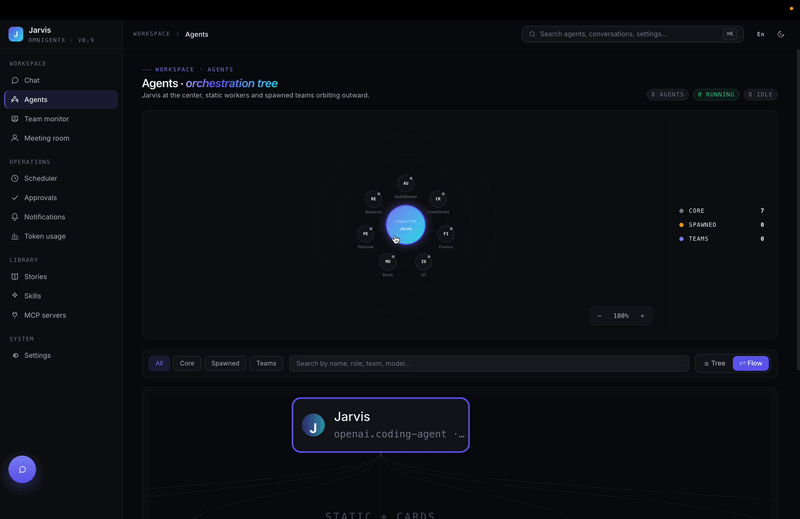
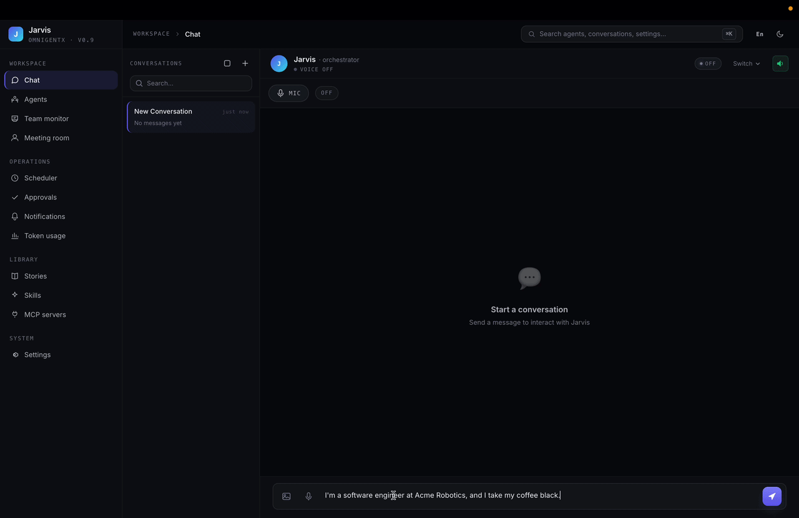
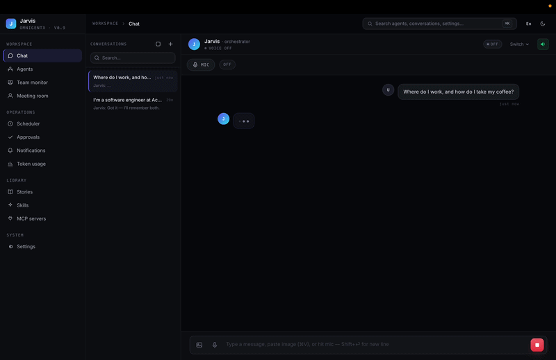
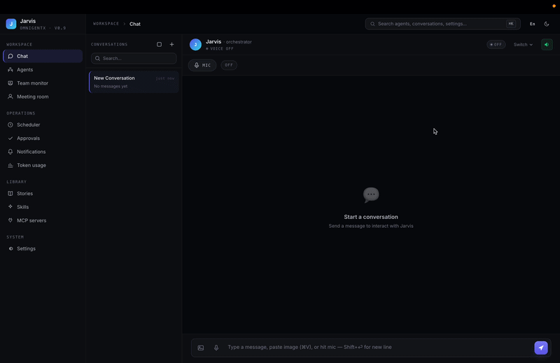
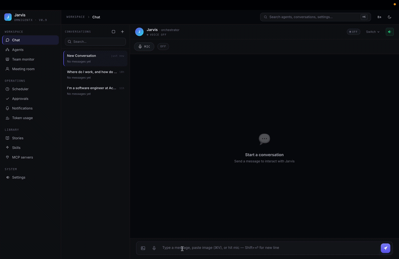

# Jarvis

[](LICENSE)
[](https://www.python.org/downloads/)
[](CODE_OF_CONDUCT.md)
[](CONTRIBUTING.md)

Self-hostable AI assistant built on [fast-agent](https://github.com/evalstate/fast-agent) with the Model Context Protocol (MCP). Spawns a multi-agent team that can plan, research, design, code, test, and deploy together.

> **Status:** active development. Public release lineage starts at `v1.0.0`.
> Core architecture is documented in [`AGENTS.md`](AGENTS.md) and
> [`docs/SELF_HOSTING.md`](docs/SELF_HOSTING.md).

## What it does

- **Multi-agent spawn**: a 7-role agile team (PM, BA, SA, Dev, Designer, QE, DSO) coordinates over inter-agent email and meeting protocols.
- **MCP-first tools**: filesystem, GitHub, Atlassian, Figma, web scraping (Scrapling), Roborock vacuum, Google Calendar / Gmail, story crawler, TTS — all exposed as MCP servers.
- **Hands-free voice**: real-time STT (faster-whisper, VAD, optional wake word) + streaming TTS (Edge default; ElevenLabs / OpenAI / Azure / System opt-in) over WebSocket, with barge-in. Stories are locked to free Edge so paid engines never burn long-form quota.
- **Web dashboard**: Vue + Vite UI for chatting with Jarvis, configuring providers, voice engines, viewing agent timelines, managing secrets.
- **Self-host friendly**: single `docker compose up -d` brings up the whole stack on a Linux box.

## See it in action

**Not one chatbot — a whole team.** Jarvis orchestrates a roster of specialist agents (research, finance, IoT, music, and more) — each one inspectable and directly reachable.



**It remembers you — across conversations.** Tell Jarvis a fact once; it saves to durable memory (not just chat history) and recalls it later in a brand-new conversation — no scrolling back, no re-explaining.

1. Teach it a fact:



2. Ask in a brand-new conversation — it recalls:



**Chat with any specialist directly — not just the orchestrator.** Switch straight to a subagent (here, the IoT agent) and ask your robot vacuum for its live status — real IoT (Roborock), not a mockup.



**And it extends itself — live.** No tool for the job? Jarvis scaffolds, installs, and wires in a brand-new MCP tool, then uses it in the same conversation — no package to hunt down, no redeploy.



## Quick start

```bash
git clone --recurse-submodules https://github.com/omnigentx/jarvis.git
cd jarvis

# Copy and edit secrets
cp backend/.env.example backend/.env
cp backend/fastagent.secrets.yaml.example backend/fastagent.secrets.yaml
# Edit both files with your API keys

docker compose up -d --build
```

- Web UI: <http://localhost>
- Backend API: <http://localhost:8000>

For a full self-host walkthrough (firewall, SSL, GitHub Actions self-hosted runner, Cloudflare Tunnel) see [`docs/SELF_HOSTING.md`](docs/SELF_HOSTING.md).

## Project layout

```
jarvis/
├── backend/                    FastAPI server, fast-agent runtime, MCP tool servers
│   ├── agent.py                Static agent definitions (Jarvis + sub-agents)
│   ├── server.py               FastAPI entry point + lifespan
│   ├── routes/                 HTTP/SSE endpoints
│   ├── services/               Business logic (sessions, spawn bridge, TTS, ...)
│   ├── tools/                  Custom MCP tool servers (IoT, story crawler, ...)
│   ├── team_templates/         Agent team definitions (agile_team.yaml)
│   ├── fast-agent/             Submodule — fast-agent framework + spawn system
│   ├── figma-ui-mcp/           Submodule — Figma MCP server
│   ├── mcp-atlassian/          Submodule — Atlassian MCP server
│   ├── realtimestt_src/        Submodule — fork of KoljaB/RealtimeSTT (hands-free STT)
│   └── realtimetts_src/        Submodule — fork of KoljaB/RealtimeTTS (streaming TTS)
├── frontend/                   Vue 3 + Vite web UI (the active frontend)
├── xiaozhi_integration/        🧪 Experimental — bridges a Xiaozhi ESP32 device to the backend over MCP
├── docs/                       Self-hosting and architecture docs
└── docker-compose.yaml         Top-level stack (backend + web)
```

## Architecture in one paragraph

Jarvis is a `fast-agent` application. A root agent (Jarvis) delegates tool calls to a curated set of sub-agents, each backed by its own MCP servers. The spawn system lets Jarvis (or a PM agent) dynamically launch isolated agent subprocesses for parallel work. Agents communicate via an inter-agent email bus and a meeting-room protocol. Sessions, agent registry, and secrets live in SQLite under `backend/data/` (gitignored). Skills (Markdown files with YAML frontmatter) inject reusable prompts and references at runtime. See [`AGENTS.md`](AGENTS.md) for a deeper tour.

## Community

- Questions, ideas, show-and-tell → [GitHub Discussions](https://github.com/omnigentx/jarvis/discussions)
- Actionable bugs / feature requests → [GitHub Issues](https://github.com/omnigentx/jarvis/issues)
- All participants are expected to follow the [Code of Conduct](CODE_OF_CONDUCT.md).

## Contributing

Pull requests welcome. Please read [`CONTRIBUTING.md`](CONTRIBUTING.md) before opening one.

## Privacy & external APIs

Voice and chat features can route through cloud providers. What
leaves your host per backend:

**TTS (text-to-speech)** — sends the text body:

| Engine     | Network egress         | Default |
|------------|------------------------|---------|
| edge       | Microsoft Edge TTS API | ✅      |
| soniox     | Soniox (US)            | opt-in  |
| elevenlabs | ElevenLabs (US)        | opt-in  |
| openai     | OpenAI (US)            | opt-in  |
| azure      | Microsoft Azure        | opt-in  |
| system     | Local only             | opt-in  |

**STT (speech-to-text)** — sends audio frames:

| Engine          | Network egress | Default |
|-----------------|----------------|---------|
| faster_whisper  | Local only     | ✅      |
| gipformer_vi    | Local only     | opt-in  |
| soniox          | Soniox (US)    | opt-in  |

**Chat LLM** — your messages + tool outputs are sent to whichever
provider you configure (Anthropic / OpenAI / OpenRouter / local
Ollama / etc). Pick the one whose privacy policy fits your data.

For sensitive content, choose a local-only path: `faster_whisper`
STT + `system` TTS + Ollama for the chat LLM. Settings → Voice
shows a **Cloud** / **Local** chip next to every engine in the
picker so you can tell at a glance.

## Security

Found a vulnerability? See [`SECURITY.md`](SECURITY.md). Please don't file public issues for security bugs.

## License

[MIT](LICENSE) © 2026 Phuc Nguyen Van.

Jarvis bundles third-party components under their own terms (Apache-2.0
and others). See [`NOTICE`](NOTICE) for the attribution list.
